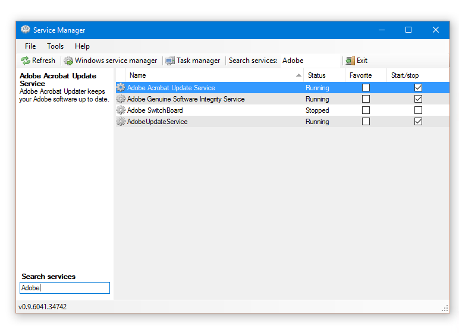
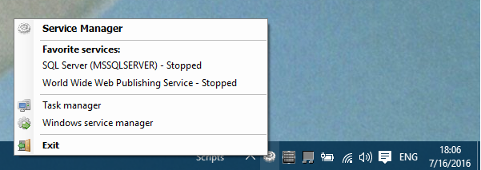

# Service Manager Tray for Windows
  
## Project Description
Do you spend lots of time starting up the service manager?  
Do you develop a lot and start/stop/restart services?  
If so, you came to the right place!  

## Main window screenshot

## Tray

## Developer
[http://patrikx3.com](http://patrikx3.com)

# Some reviews
http://www.softpedia.com/get/System/System-Miscellaneous/Service-Manager-Tray.shtml

http://www.01net.com/telecharger/windows/Utilitaire/systeme/fiches/136343.html

https://briian.com/6368/

http://www.brothersoft.com/service-manager-tray-293357.html

# Publish 

http://publisher.appvisor.com/

&copy; Jun 29, 2009
